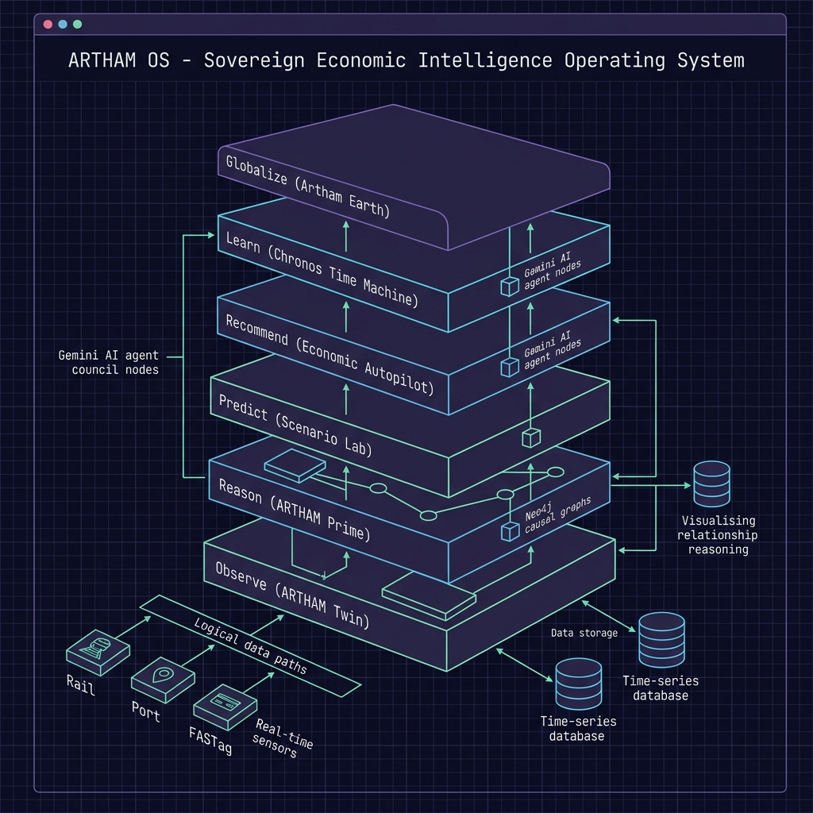
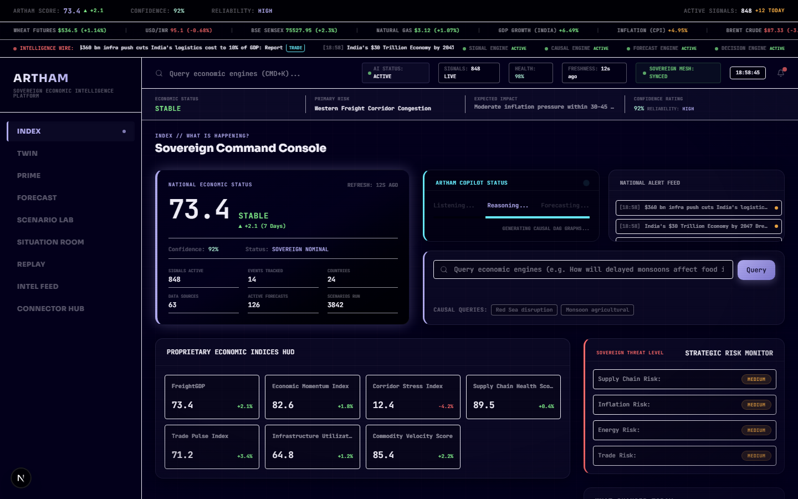
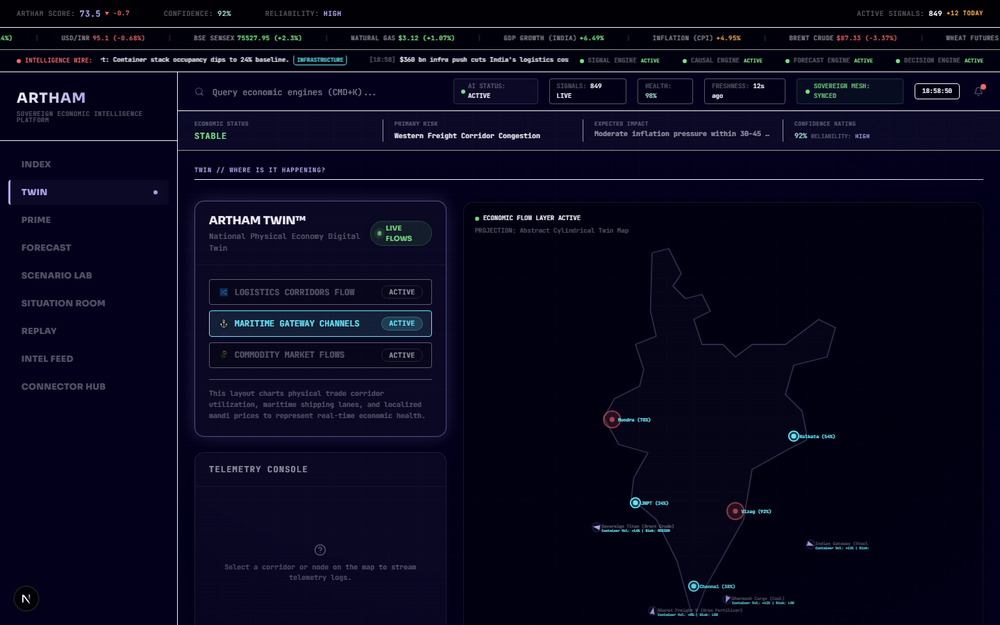
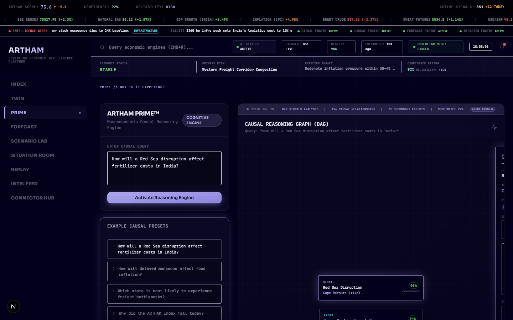
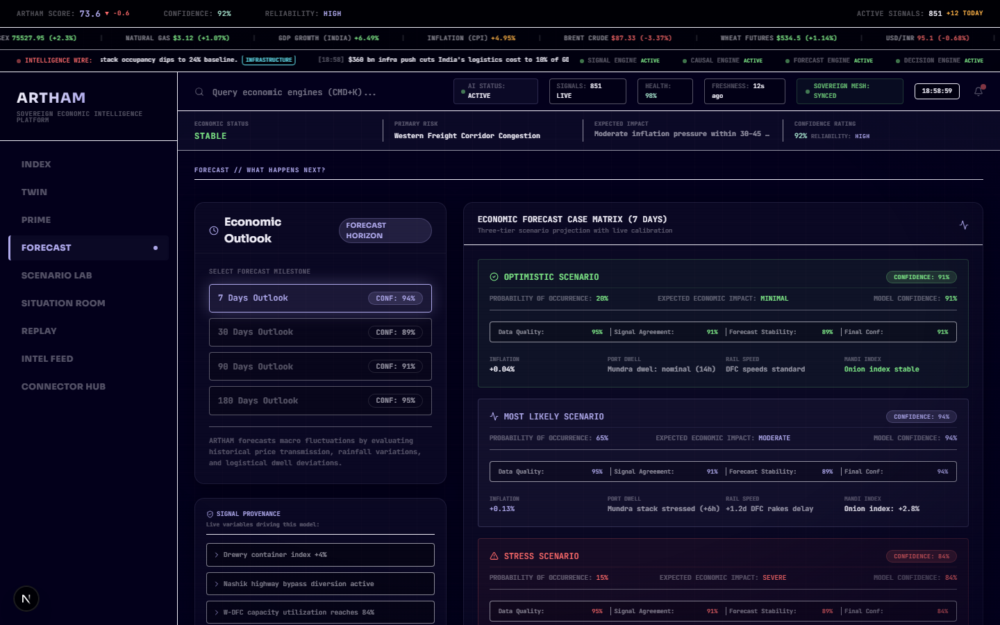
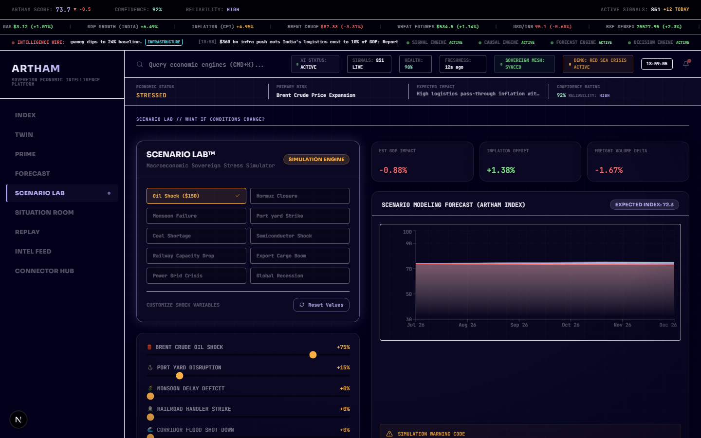
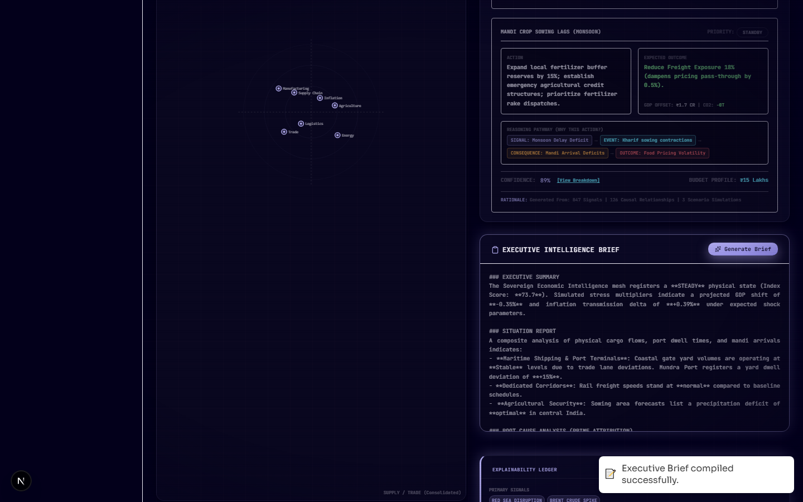
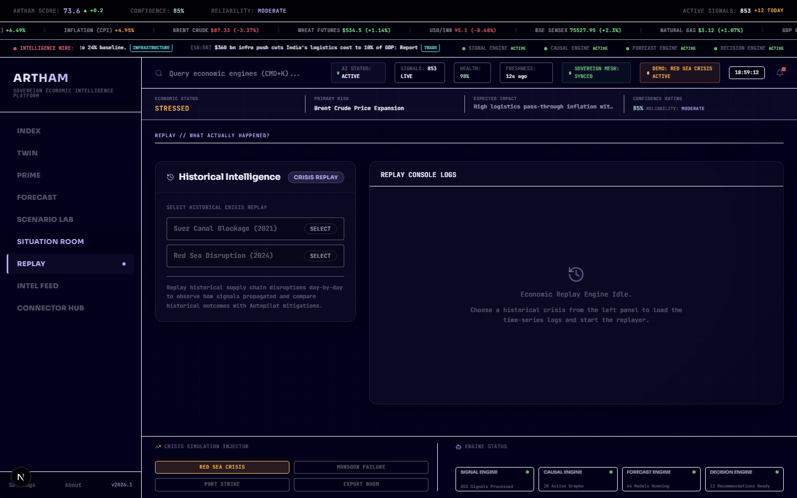

# ARTHAM OS

### The Sovereign Economic Intelligence Operating System

⚡ **Observe** → **Reason** → **Forecast** → **Recommend** → **Learn**

---

[](https://nextjs.org/)
[](https://react.dev/)
[](https://www.typescriptlang.org/)
[](https://tailwindcss.com/)
[](LICENSE)
[](#deployment)

---

## 📖 Table of Contents
* [🌐 Live Demo & Submission links](#-live-demo--submission-links)
* [🌟 Vision & Overview](#-vision--overview)
* [🏗 System Architecture](#-system-architecture)
* [🖥 Platform Preview (Screenshots)](#-platform-preview-screenshots)
* [🧩 Module Overview](#-module-overview)
* [🛠 Technology Stack](#-technology-stack)
* [🔄 System Information Flow](#-system-information-flow)
* [⚡ Getting Started](#-getting-started)
* [📚 Full Documentation Indexes](#-full-documentation-indexes)
* [📄 License](#-license)

---

## 🌐 Live Demo & Submission links
*   **Live Demo Link**: *[Live Vercel Deployment Link Placeholder]*
*   **Demo Video Presentation**: *[YouTube Demo Video Link Placeholder]*
*   **Pitch Deck Presentation**: *[Google Slides Pitch Deck Link Placeholder]*
*   **Start Here Guide**: [docs/JUDGE_GUIDE.md](docs/JUDGE_GUIDE.md)

---

## 🌟 Vision & Overview
**Financial markets have Bloomberg. The physical economy has ARTHAM OS.**

ARTHAM OS is a decision-intelligence operating system for the physical economy. It links high-frequency physical telemetry (toll road speeds, port dwell latency, freight rakes, crop yields) with core national macroeconomic outcomes (pass-through retail inflation, supply chain health indices, and industrial GDP momentum). Rather than reacting to stale, lagging statistics, ARTHAM OS empowers governments, infrastructure operators, and monetary planners to monitor, reason, and simulate economic shocks in real-time.

---

## 🏗 System Architecture

Below is the conceptual layers mapping of ARTHAM OS. The system fuses time-series data streams with causal relational matrices to support automated reasoning.


*Figure 1: ARTHAM OS Systems Topology (Telemetry Ingestion → Storage Fusion → AI Reasoning Stack → Sovereign UI)*

---

## 🖥 Platform Preview (Screenshots)

### 1. INDEX (Sovereign Command Console)
The primary landing dashboard displaying the sovereign economic momentum scorecards, real-time alerts wire, and the active Strategic Risk Monitor.



### 2. TWIN (Observe: National Infrastructure digital twin)
Interactive digital twin mapping trade corridor utilization and vessel port latency.



### 3. PRIME (Reason: Causal Reasoning Engine)
AI-Agent Council reasoning bar translating unstructured shocks into step-by-step causal graphs explaining transmission to retail price indexes.



### 4. FORECAST (Project: Leading Projections)
Forecast curves displaying predicted inflation transmission and capacity indexes.



### 5. SCENARIO LAB (Simulate: Sovereign Stress Sandbox)
planners sandbox allowing users to slider-test custom oil shocks, port disruptions, or monsoon deficits across three-tier bands.



### 6. SITUATION ROOM (Recommend: Economic Autopilot Cockpit)
Decision intelligence compiling active logistical override recommendations, carbon offsets, and step-by-step reasoning pathways.



### 7. REPLAY (Learn: Trust Calibration Ledgers)
Analytical rewind and replay time-machine evaluating historical crisis responses against baseline datasets.



---

## 🧩 Module Overview

*   **INDEX (Command HUD)**: Renders composite index scoreboard and strategic risk monitoring.
*   **TWIN (Observability)**: Plots road velocities, maritime queues, and mandi price variations.
*   **PRIME (Reasoning)**: Generates Causal Directed Acyclic Graphs (DAGs) verified by agent council audits.
*   **FORECAST (Projections)**: Predicts leading indicator trends and maps signals to impacted sectors.
*   **SCENARIO LAB (Simulation)**: Stress-tests custom shock parameters (e.g. $150 Crude Oil, port walkouts).
*   **SITUATION ROOM (Autopilot)**: Compiles dynamic rerouting plans, emission profiles, and time savings.
*   **REPLAY (Calibration)**: Replays historical disruptions to recalibrate future model weights.

---

## 🛠 Technology Stack

*   **Core framework**: Next.js 16 (Turbopack) & React 19
*   **Language**: TypeScript
*   **Styling**: TailwindCSS & Framer Motion (micro-animations)
*   **Charts & Diagrams**: Recharts & Mermaid.js
*   **Database Mock Storage**: Zustand & React CountUp
*   **Reasoning Engine**: Google Gemini API (Agent Council simulation)

---

## 🔄 System Information Flow
ARTHAM OS processes data continuously:
$$\text{Observe Telemetries} \longrightarrow \text{Reason Causal Graphs} \longrightarrow \text{Forecast Ripple Bands} \longrightarrow \text{Recommend Interventions} \longrightarrow \text{Learn Replays}$$

1. **Observe**: Telemetries (FASTag FAST, port dwell metrics) monitor corridor status.
2. **Reason**: Out-of-bounds anomalies trigger PRIME to map causal graphs.
3. **Forecast**: Projections measure expected index volatility.
4. **Recommend**: Situation Room suggests dynamic bypass blueprints and carbon savings.
5. **Learn**: Chronos replays historical crises to recalibrate model weights.

---

## ⚡ Getting Started

### Prerequisites
*   Node.js (v18.x or later)
*   NPM (v10.x or later)

### Installation & Run
1. Clone the repository and navigate to the project folder.
2. Set up environment variables:
   ```bash
   cp .env.example .env.local
   ```
   Open `.env.local` and add your `GEMINI_API_KEY`.
3. Install dependencies:
   ```bash
   npm install
   ```
4. Start the development server:
   ```bash
   npm run dev
   ```
5. Open [http://localhost:3000](http://localhost:3000) to view the terminal UI.

---

## 📚 Full Documentation Indexes
*   **[docs/JUDGE_GUIDE.md](docs/JUDGE_GUIDE.md)**: Recommended walkthrough path and evaluation targets.
*   **[docs/PROJECT_OVERVIEW.md](docs/PROJECT_OVERVIEW.md)**: 2-minute overview of problem, solution, and vision.
*   **[docs/ARCHITECTURE.md](docs/ARCHITECTURE.md)**: System design and technology layers breakdown.
*   **[docs/MODULES.md](docs/MODULES.md)**: Tab-by-tab input/output telemetry descriptions.
*   **[docs/SYSTEM_FLOW.md](docs/SYSTEM_FLOW.md)**: Telemetry pipelines and learning calibration loops.
*   **[docs/archive/artham_os_x_civilization_architecture.md](docs/archive/artham_os_x_civilization_architecture.md)**: Original systems development notes.

---

## 📄 License
This project is licensed under the MIT License - see the [LICENSE](LICENSE) file for details.
