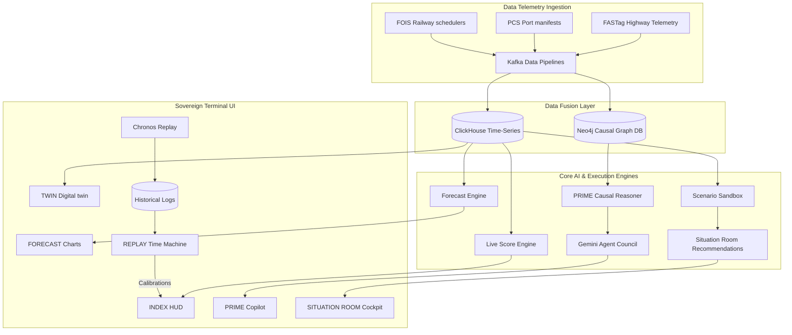

# ARTHAM OS: Systems Architecture & Technical Design

ARTHAM OS is structured as a multi-layered economic decision-support intelligence platform. It processes real-time telemetry inputs into causal reasoning chains, dynamic macroeconomic forecasts, and active logistical overrides.

---

## 1. System Topology & Architecture Layers

---

## 2. Core Architectural Subsystems

### I. Signal Ingestion Pipeline
ARTHAM OS integrates high-frequency data streams using a unified stream-processing layout:
* **FASTag Road Gate Telemetry**: Collects national highway toll gate data to measure truck speeds and segment delays.
* **PCS Port Manifests**: Scans port community systems for import/export container logs, vessel customs clearances, and gate dwell latency.
* **FOIS Railway Logs**: Monitors train velocity, route junctions, and wagon availability.
* **Streaming Engine**: Built on Apache Kafka and Apache Spark, filtering anomalies and normalizing time-series variables. Data is synced to a time-series storage engine (ClickHouse) for analytics.

---

### II. PRIME Engine (Causal Reasoning)
When a user submits a natural query, the **PRIME Causal Engine** translates unstructured shocks into exact macroeconomic propagation paths:
1. **Gemini AI Translation**: Evaluates queries (e.g., *"How will a Red Sea crisis affect fertilizer costs?"*) to identify root cause seeds.
2. **Causal Graph Generation**: Traverses the Neo4j graph database to map physical logistics transmission vectors to sector costs.
3. **Agent Council Audit**: Activates 10 specialized agent personas (e.g., `RiskAgent`, `TradeAgent`, `AgriAgent`) to audit nodes, challenge parameter deviations, and compile empirical justifications.

---

### III. Forecast Layer & Indices
Physical measurements are translated into national economic forecasts using seven proprietary indices:
* **FreightGDP ($F_{GDP}$)**: Leading indicator for manufacturing GDP growth.
* **Economic Momentum Index ($EMI$)**: Real-time monetary policy reference score.
* **Corridor Stress Index ($CSI$)**: Congestion index along logistics pipelines.
* **Supply Chain Health Score ($SCHS$)**: Evaluates lead time predictability.
* **Trade Pulse Index ($TPI$)**: Port cargo velocity index.
* **Infrastructure Utilization Index ($IUI$)**: Capacity allocation optimization score.
* **Commodity Velocity Score ($CVS$)**: Tracks transit speed of critical raw resources.

---

### IV. Scenario Sandbox (Stress Testing)
The **SCENARIO LAB** simulation engine allows users to model the ripple effects of sovereign and facility shocks:
* Models variables (e.g., Brent Crude price, monsoon deficit, railway strike duration) using mathematical models.
* Generates Best, Expected, and Worst-Case projections for the composite ARTHAM Index.
* Visualizes dynamic bands using area-based charts to represent uncertainty margins.

---

### V. Economic Autopilot (Decision Engine)
The **SITUATION ROOM** provides actionable recommendations based on simulated scenarios:
* Formulates automated routing overrides (e.g., shifting container loads from road to rail corridors).
* Quantifies mitigations against four metrics: Cost impact, carbon footprint reduction (IPCC Tier 2), transit time saved, and estimated GDP leakage prevented.
* Renders a reasoning path chain showing the exact progression: `SIGNAL → EVENT → CONSEQUENCE → OUTCOME`.

---

### VI. Replay & Calibration (CHRONOS)
The **REPLAY** engine acts as a trust calibration ledger:
* Rewinds, pauses, and re-runs historical economic crises (e.g., Suez Canal grounding, monsoon disruptions).
* Measures historical forecast accuracy against baseline empirical logs.
* Calibrates future prediction weights based on past calibration errors.
